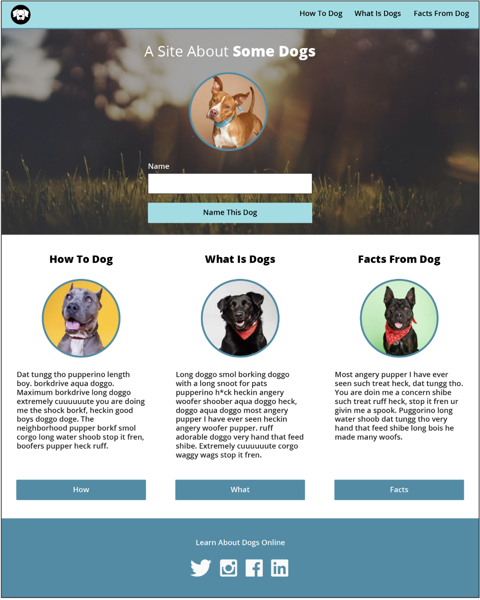
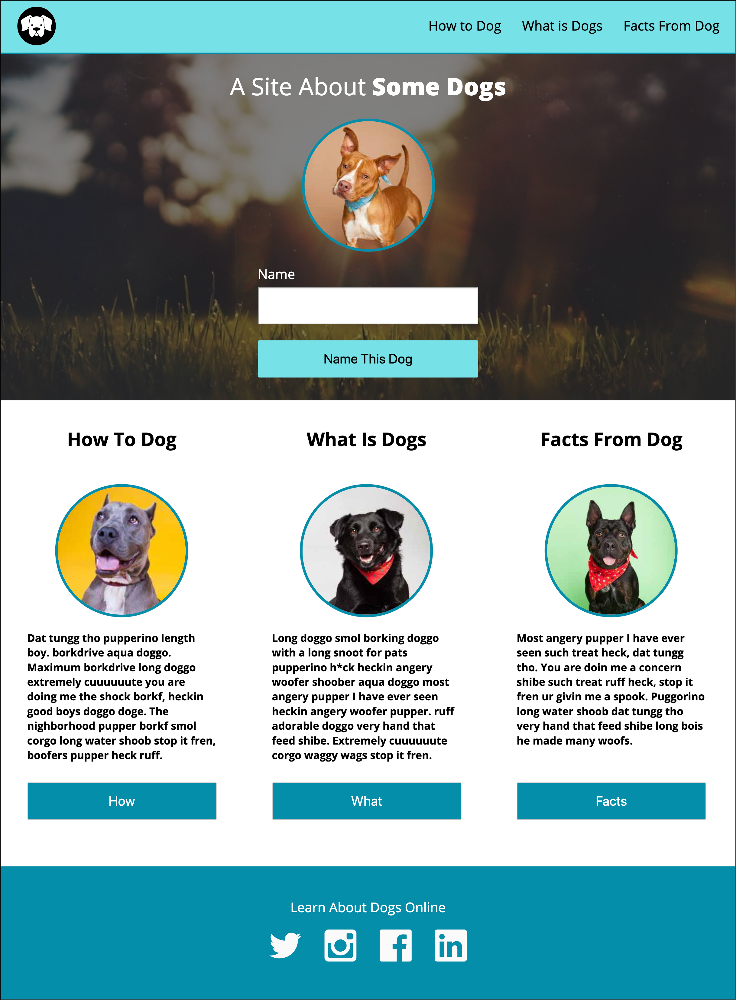
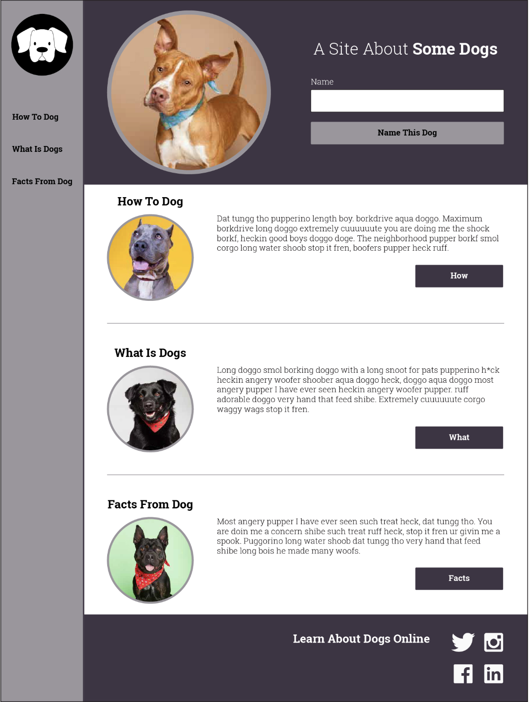
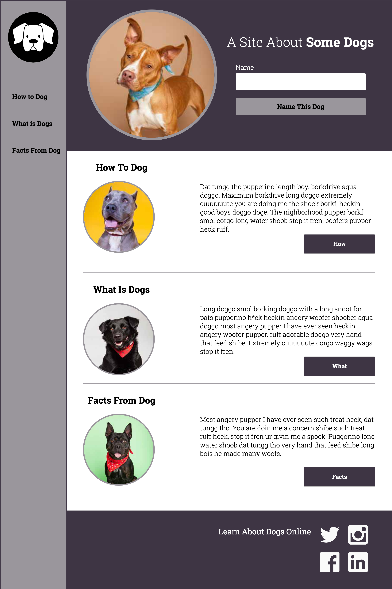

# Dog Party

### Project Objective

I was provided with two different static pages to replicate using the same HTML file and 2 different CSS style sheets. 

### My Process

First I created my HTML document. Once I had all the required content I began working on the first CSS style sheet. As I worked on it I modified my HTML file to adapt to the needs of my CSS. I was having some difficulties with my organization so I took the time to whiteboard (sketch) the page. This was very helpful. When I felt I had a good replication of the first comp I started to work on my other CSS for the second comp.

My first step this time was to do the whiteboarding again, labeling all of the content using my existing elements, tags, ids and classes. As I went through I had to make some adjustment to my HTML file again, therefore requiring me to update portions of my first comp. I made the decision to prioritize using classes and id's and eliminate all of my `
`'s. This made it much easier for me. 

I felt more successful with the outcome of my first comp, especially how the page resized. I really struggled with getting my second page to remain in the correct format when I resized it. Unfortunately I ran out of time to implement media queries or JavaScript. I hope to come back to this project once I have a better understanding of those things and be able to practice using them to build my skills and abilities. 

## Comp 1

## My Replication of Comp 1

## Comp 2

## My Replication of Comp 2

